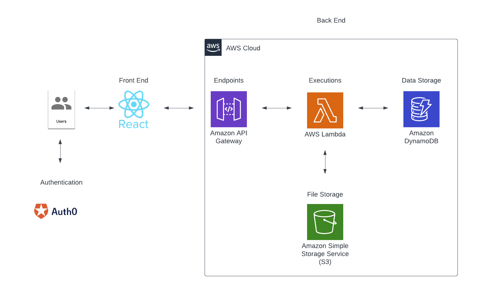

# Form 485 Generator

## Project Overview

### Purpose

The primary objective of this project is to streamline and digitalize the process of capturing and managing user data in a structured form format. Leveraging modern web technologies and cloud services, the platform aims to:
1. User Authentication and Security: With the integration of Auth0, ensure that each user's data is secure and can only be accessed by authenticated individuals.
2. User-Friendly Data Input: Through a responsive web interface, users can seamlessly fill out complex forms and intuitive UI components.
3. Data Persistence and Retrieval: Utilize AWS services such as Lambda, DynamoDB, and S3 to securely store and retrieve user input data, ensuring durability and high availability.
4. On-Demand PDF Form Generation: After saving their data, users have the option to generate a populated PDF form by pressing the ‘Download PDF' button. This provides them with a filled-out version of the form that maintains the standardized format and can be readily shared or printed.
5. Scalability and Performance: By leveraging AWS infrastructure, ensure that the application can handle varying loads, from a few users to thousands, without compromising on performance or user experience.

### Architecture Diagram

